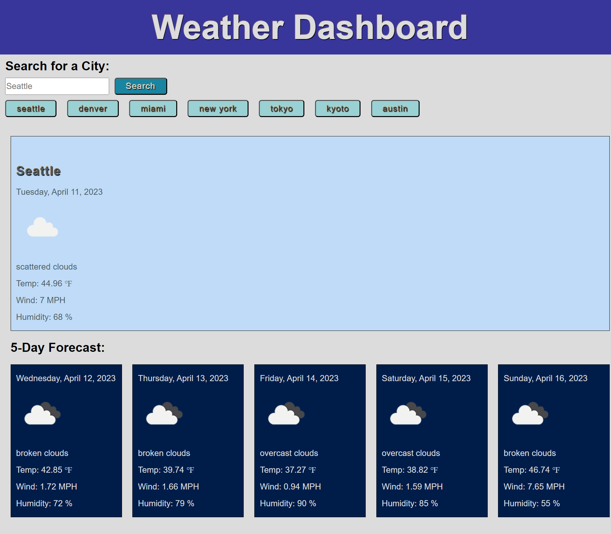
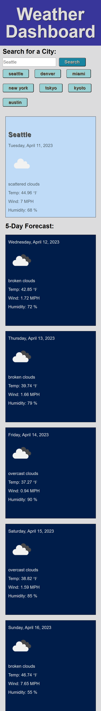

# weather-dashboard

## Description

I learned how to use an API and pull data from a non-local source and display the information in a webpage. I learned how to use API keys to access data and how to save search data in local storage. Using the Open Weather API data, I created a dashboard with the current weather for a city and the five day weather forecast.

### User Story

```
AS A traveler
I WANT to see the weather outlook for multiple cities
SO THAT I can plan a trip accordingly
```

### Acceptance Criteria

```
GIVEN a weather dashboard with form inputs
WHEN I search for a city
THEN I am presented with current and future conditions for that city and that city is added to the search history
WHEN I view current weather conditions for that city
THEN I am presented with the city name, the date, an icon representation of weather conditions, the temperature, the humidity, and the wind speed
WHEN I view future weather conditions for that city
THEN I am presented with a 5-day forecast that displays the date, an icon representation of weather conditions, the temperature, the wind speed, and the humidity
WHEN I click on a city in the search history
THEN I am again presented with current and future conditions for that city

```

## Installation

N/A

## Usage

Create a weather dashboard.

### Deployed Site
https://fevercatdream.github.io/weather-dashboard/

<br />

### Weather Dashboard Desktop View


<br />

### Weather Dashboard Mobile View


<br />


## Credits

Tutor: Doug Kumagai:
<br />
https://www.linkedin.com/in/doug-kumagai/
<br />
https://github.com/ndesmic


mdn web docs: https://developer.mozilla.org/en-US/

How to Use API Keys: https://coding-boot-camp.github.io/full-stack/apis/how-to-use-api-keys

OpenWeather API: https://openweathermap.org/forecast5


## License

Please refer to the LICENSE in the repo.